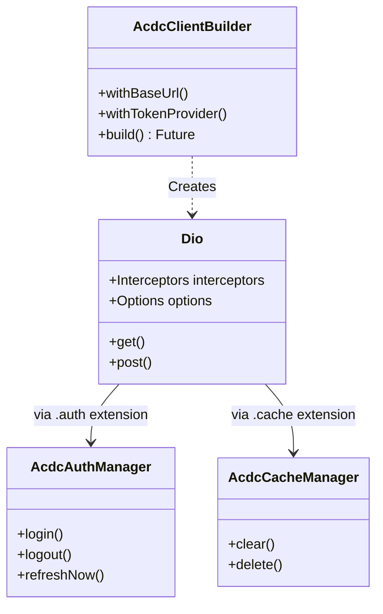
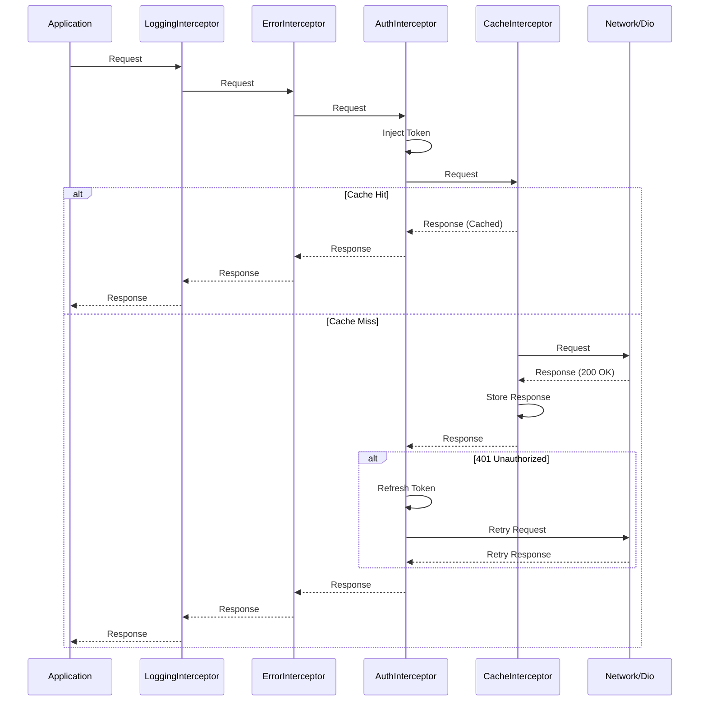
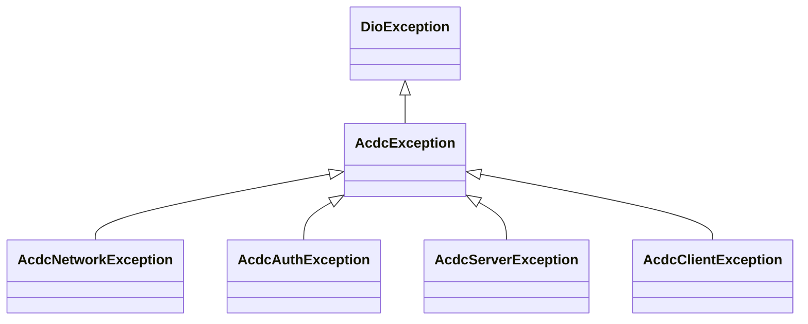

# Architecture

Dart ACDC (Advanced Client for Dio Communication) is designed as a robust, production-ready wrapper around [Dio](https://pub.dev/packages/dio). It leverages Dio's interceptor pattern to provide built-in authentication, caching, error handling, and logging capabilities.

## High-Level Design

The library is built around the **Builder Pattern**. The `AcdcClientBuilder` allows consumers to configure the client (base URL, timeouts, auth endpoints) and produces a standard `Dio` instance.

This `Dio` instance is enhanced with:
1.  **Interceptors**: A pre-configured chain of interceptors handling cross-cutting concerns.
2.  **Extensions**: `dio.auth` and `dio.cache` getters that provide access to management controllers (`AcdcAuthManager` and `AcdcCacheManager`).

## Interceptor Chain

The core logic resides in the interceptor chain. The order is critical to ensuring correct behavior (e.g., logging happens for all requests, auth happens before caching).

**Request Flow (Outbound):**
1.  **Logging**: Logs the initial request parameters.
2.  **Error**: Prepares to catch exceptions from inner layers.
3.  **Auth**: Injects the Access Token. checks if proactive refresh is needed.
4.  **Cache**: Checks if a valid response exists in storage. If **HIT**, returns response immediately (short-circuit).
5.  **Custom**: User-defined interceptors (e.g., specific API headers).
6.  **Network**: Sending the request.

**Response Flow (Inbound):**
1.  **Network**: Receives raw response.
2.  **Custom**: Processes response.
3.  **Cache**: Saves the response if it's cacheable (Cache-Control headers).
4.  **Auth**: Checks for 401 Unauthorized. If found, locks queue, refreshes token, and retries.
5.  **Error**: Standardizes errors into `AcdcException` hierarchy.
6.  **Logging**: Logs the final response or error.

## Core Components

### 1. Authentication (`src/auth`)
*   **TokenProvider**: Interface for secure storage (Keychain/Keystore).
*   **AuthInterceptor**: 
    *   Injects `Authorization: Bearer <token>`.
    *   Handles **Reactive Refresh**: Intercepts 401, refreshes token, retries request.
    *   Handles **Proactive Refresh**: Checks token expiry before request; refreshes if close to expiring.
    *   **Concurrency**: Uses a `CircularQueue` (or locking mechanism) to ensure only one refresh happens at a time; other requests wait.

### 2. Caching (`src/cache`)
*   **CacheInterceptor**: Implements HTTP caching logic.
    *   Respects `Cache-Control` (max-age, no-cache, no-store).
    *   Supports `ETag` / `If-None-Match`.
*   **TwoTierCacheStore**: Reference implementation combining:
    *   **L1 (Memory)**: Fast access for recent requests.
    *   **L2 (Disk)**: Persistent storage using Hive/JSON.
*   **EncryptedCacheStore**: Specific L2 implementation that encrypts data on disk using standard algorithms (AES).

### 3. Error Handling (`src/exceptions`)
Wraps all exceptions in a unified hierarchy extending `DioException`:

*   **AcdcNetworkException**: No internet, timeout, DNS.
*   **AcdcAuthException**: 401, 403, Token refresh failed.
*   **AcdcServerException**: 5xx errors.
*   **AcdcClientException**: 4xx errors (bad request, not found).

## Design Decisions

*   **Composition over Inheritance**: We do not extend `Dio`. We build *on top* of it. This allows easy upgrades of the underlying Dio package.
*   **Immutability**: `AcdcClientBuilder` is immutable. Configuration methods return new instances, preventing side-effect bugs during initialization.
*   **Strict Layering**: Interceptors are strictly ordered. Auth doesn't know about Cache; it just sees a request/response. This decoupling makes testing individual components easier.
